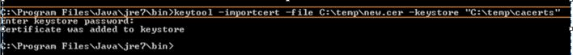

# RestAPIAutomation
Restfull API automation

## API To be tested:
https://api.tmsandbox.co.nz/v1/Categories/6327/Details.json?catalogue=false

## Acceptance Criteria:

* Name = "Carbon credits"
* CanRelist = true/n
* The Promotions element with Name = "Gallery" has a Description that contains the text "2x larger image"

## System Setup:

1. Set up Java , Eclipse and TestNG.
2. In case if any SSL Certification issue is encountered while running the code in eclipse.Please follow the below steps to mitigate the issue: 
   - **The error you will see is** : “Caused by: sun.security.validator.ValidatorException: PKIX path building failed:sun.security.provider.certpath.SunCertPathBuilderException: unable to find valid certification path to requested target”
   - **Root Cause**: This issue happens when your local computer attempts to connect to the cloud, and the security certificates
        in your Local Computer Keystore, do not match. This is an issue with the testing center/security, of the 
        location where you are working.
   - **Rectification**: Adding Certificate to the JAVA Keystore - Using Google Chrome. This issue will be rectified after adding the Certification in C:\Program Files\Java\jre1.8.0_221\lib\security\cacerts
        - **Generate a new certificate file**: 
            - From your browser, click on the secure (or not secure) button, next to the cloud name. Locate and Click on Copy to File and complete the Certificate Export Wizard Steps.
            - When exporting, select the DER encoded binary X.509 (.CER) file format.
            - Save the certificate file locally. For Example, C:\temp\new.cer
        - **Update keystore with the new certificate**:
            - Copy the cacerts file to a temporary location. This step is important. In some cases updating directly to Program Files is restricted, and you will receive the keytool error "Access is denied". 
            - You might need help of your IT department , if you don’t have admin rights on your system.
            - copy "C:\Program Files\Java\jre1.8.0_151\jre\lib\security\cacerts" to "C:\temp\cacerts"
            - From CMD prompt, run the importcert command. 
                  keytool -importcert -file C:\temp\new.cer -keystore "C:\temp\cacerts" -alias mynewcert  
                  
            - The default keystore password is: changeit
            - Copy cacerts file back to Program Files location.
Now, when you run your code, it will run perfectly.x

## Steps to run :
* Import "TestingRestAPI" Project from GitHub to Eclipse.
* Right Click the TestNG.xml --> Run As --> 1 TestNG suite

## Output:

 
